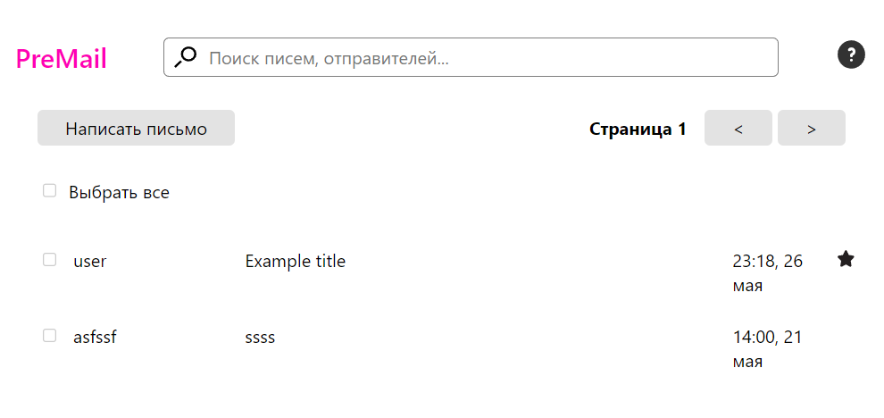
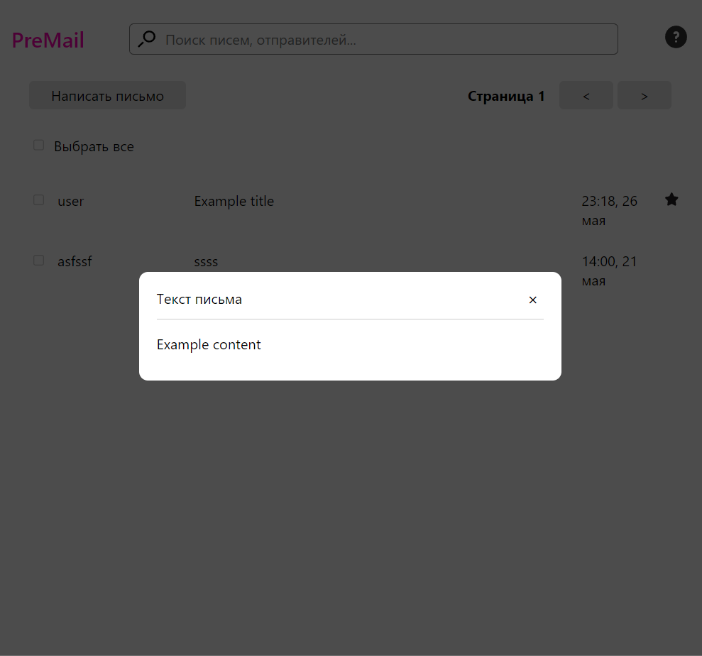
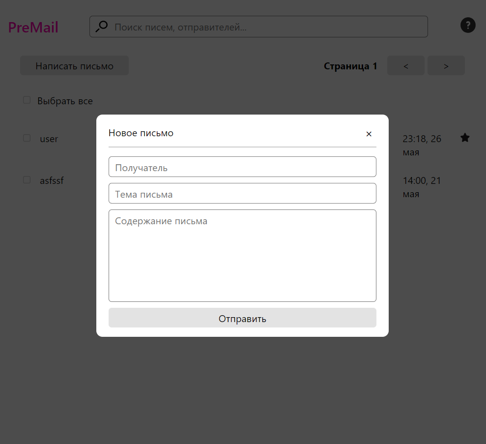

# Почтовый клиент

Проект разработан в рамках курса "Frontend-разработка на Vue.js" от студенческого 
университета [IT-LETI](https://itleti.web.app/).

## Результат 

Главный экран с письмами



Содержимое письма



Форма отправки письма



## Команды

Запустить dev-сервер
```bash
$ npm run dev
```

Собрать production bundle
```bash
$ npm run build
```
